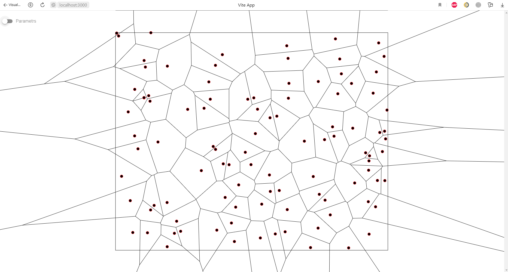

# VoronoiDiagram
Example1. n = 100 (1000 x 800)



Example2. n = 1000 (1000 x 800)


## Need instruments

- Maven
- open-jdk-22
- Node.js

## Recommended IDE Setup

Front: [VSCode](https://code.visualstudio.com/) + [Volar](https://marketplace.visualstudio.com/items?itemName=Vue.volar) (and disable Vetur) + [TypeScript Vue Plugin (Volar)](https://marketplace.visualstudio.com/items?itemName=Vue.vscode-typescript-vue-plugin).

Back: [IDEA Intellij](https://www.jetbrains.com/ru-ru/idea/)

## Docker-compose

```sh
cd src/backend && mvn install && cd - && 
docker-compose build && docker-compose up
```
Path: http://127.0.0.1:3000

## Manual assembly

Backend
```sh
cd src/backend && mvn install && mvn spring-boot:run && cd -
``` 

Frontend
```sh
cd src/frontend/ && npm ci && npm run dev && cd -
```

Path: http://localhost:3000/


